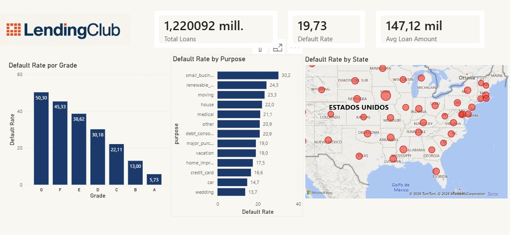

# LendingClub — Default Prediction

EDA and default prediction on loans using SQL, Python and MLflow

## Overview
End-to-end data project analyzing loan default risk using LendingClub data (2010–2018).
The goal is to identify the key drivers behind loan defaults using EDA and Machine Learning.

## Tools & Technologies
- **SQL** — Data cleaning and exploration (DuckDB + SQL Magic in Google Colab)
- **Python** — EDA and data visualization (Pandas, Matplotlib, Seaborn)
- **Power BI** — Interactive dashboard with KPIs
- **MLflow** — Experiment tracking for ML models
- **Optuna** — Hyperparameter optimization

## EDA Key Findings
- Grade G loans have a **50.3% default rate** vs 5.7% for Grade A
- Small business loans show the **highest default rate** (30.2%)
- Defaulted borrowers have higher DTI (20.14 vs 17.85) and lower income ($72k vs $79k)
- Employment length shows **no significant impact** on default rate

## Dashboard


## Machine Learning

Five models were trained and tracked with MLflow:
- Logistic Regression (baseline)
- Random Forest (baseline + Optuna)
- XGBoost (baseline + Optuna)

### Model Comparison


### ML Key Findings
- Logistic Regression had the best baseline Recall (0.63) and ROC-AUC (0.71)
- XGBoost_Optuna achieved the best ROC-AUC (0.72) but poor Recall (0.11) at default threshold
- **Threshold tuning unlocked XGBoost's potential**: at threshold=0.20, Recall jumped to 0.70 with the best F1-Score (0.43)

### Final Recommendation
**XGBoost (Optuna-tuned) with threshold = 0.20** is the recommended model,  it correctly identifies 70% of defaulters while maintaining the best overall precision-recall balance.

## Project Structure
```
├── EDA.ipynb — SQL cleaning + exploratory analysis
├── ML_LendingClub.ipynb — Model training, Optuna tuning, MLflow tracking
├── lending_club_dashboard.jpeg — Power BI dashboard
├── mlflow_comparison.png — MLflow experiment comparison
└── README.md

